# Outskirts: The Sovereign AI Workbench
## TEAM : PRITHVEDA | PROBLEM STATEMENT : 26117 |  KARTIK KHANDELWAL ( LEADER )  |  TEAM MEMBERS : SARTHAK SHRIVASTAV  | SOURABH SAHU  | PAVANI JAISWAL  | ARCHIT VISHWAKARMA | NISHA KUMARI  |
[](https://www.typescriptlang.org/)
[](https://nodejs.org/)
[](https://pnpm.io/)
[]()
[]()

> **"Sovereignty is enforced by topology, not by monitoring. What cannot reach the network cannot leak."**

Outskirts is a sovereign, self-contained, air-gapped agentic AI workbench engineered for high-stakes industrial environments: oil refineries, nuclear facilities, chemical plants, offshore platforms, and critical utility infrastructure.


---

## 🏗 Key Architectural Pillars

```mermaid
flowchart TD
    subgraph UI["Desktop Client Plane (apps/desktop)"]
        WB["Workbench Screen<br/>(Live Plan DAG & Stream)"]
        PID["P&ID Perception Viewer<br/>(BBox Bounding & GraphRAG)"]
        SOV["Sovereignty Dashboard<br/>(Locality & Packet Counters)"]
        MKT["Signed Plugin Marketplace<br/>(Ed25519 Admission)"]
        REC["Recipe Builder<br/>(User-Editable Workflows)"]
        MIC["Micro-Tool Sandbox<br/>(Journey 2 Iframe CSP None)"]
    end

    subgraph GW["Control Plane & Gateway (apps/server)"]
        AUTH["Keycloak / LDAP Auth<br/>& Cedar RBAC"]
        WS["Timeline Manager<br/>(Monotonic Seq Replay)"]
        EX["Agent Pipeline Executor<br/>(Cooperative Cancellation)"]
        REC_LIB["Recipe Library<br/>(Validated Acyclic DAGs)"]
    end

    subgraph CORE["Sovereign Core Packages (packages/*)"]
        SCH["@outskirts/schemas<br/>(47 Canonical JSON Schemas)"]
        PAL_PKG["@outskirts/pal<br/>(Sovereign Provider Abstraction)"]
        SOV_PKG["@outskirts/sovereignty<br/>(Merkle Audit Chain & in-toto)"]
        PLUG["@outskirts/plugin-sdk<br/>(Wasm & Python Tool Containers)"]
        KNOW["@outskirts/knowledge<br/>(BGE-M3 + Freshness Half-Life)"]
    end

    subgraph CAP["Capability Microservices (services/*)"]
        PERC["perception service<br/>(YOLO / Faster-RCNN + GraphRAG)"]
        ENG["engineering service<br/>(fluids, CoolProp, Pint, SymPy)"]
    end

    subgraph TOPO["Network Topology Plane (deploy/*)"]
        NET["Docker Backplane<br/>(internal: true - No Default GW)"]
        EBPF["Cilium Tetragon eBPF<br/>(Kernel-level Socket Kill)"]
    end

    UI -->|REST / WebSocket| GW
    GW --> CORE
    CORE --> CAP
    CAP --> TOPO
```



### 1. Topology Sovereignty
- **Docker Backplane (`internal: true`)**: Zero internet routing. Even root inside a compromised container cannot initiate outbound TCP handshakes.
- **Kernel-Level eBPF Kill (`deploy/tetragon`)**: Tetragon kprobe triggers instantaneous SIGKILL on any unauthorized non-internal egress socket.
- **Default SOVEREIGN Mode**: The PAL (Provider Abstraction Layer) strictly rejects external WAN endpoints by default; ASSIST mode is an intentional, explicit, auditable toggle.

### 2. The Canonical Schema Spine (`packages/schemas`)
- All system communications, tool parameters, plan steps, and verdicts are bound to 47 pre-compiled, version-controlled JSON Schemas.
- Enforced at compile-time and runtime via Zod v4 and JSON Schema validators (`pnpm schema:check`).

### 3. Signed Wasm & Container Capability Sandbox (`packages/plugin-sdk`)
- Plugins require cryptographic Ed25519 manifest signing from trusted organizational root authorities before loading.
- Resource constraints (CPU, memory, execution timeouts) enforced strictly.
- Pure arithmetic and deterministic calculations (Darcy-Weisbach pressure drop, ISA-75.01 control valve sizing) execute in isolated sandboxes with Pint uncertainty propagation ($\pm 2.5\%$).

### 4. Deterministic Critic Verification (C1–C5)
Before any engineering document is certified, five mathematical gates execute deterministically:
- **C1: Numeric Grounding** — Every number in the synthesized document traces to raw sensor readings or calculation outputs.
- **C2: Calculation Replay** — Darcy-Weisbach / ISA-75.01 equations are independently re-evaluated; drift must satisfy $|\Delta| < 0.0001$.
- **C3: Citation Resolvability** — Citations must resolve to verified chunk IDs in the sovereign document store.
- **C4: Template Completeness** — Verifies required structural sections and required engineering tokens.
- **C5: Freshness Policy** — Documents governed by stale or retired SOPs (decay $> 0.5$) automatically lock the human approval gate.

### 5. C2PA Provenance & Merkle Audit Chain
- Generated deliverables (`.docx`, `.pdf`) receive cryptographically bound C2PA assertions and Ed25519 signatures.
- Every tool call, model prompt, human override, and RBAC refusal commits to an append-only SHA-256 Merkle Audit Chain with in-toto link attestations.

---

## 📦 Monorepo Workspace Structure

```
Outskirts/
├── packages/
│   ├── schemas/         # 47 Canonical schemas (Recipe, Plan, Audit, Criticism, Finding)
│   ├── sovereignty/     # Merkle AuditChain, Ed25519 signing, C2PA manifest builder
│   ├── pal/             # Sovereign Provider Abstraction Layer & Guided JSON router
│   ├── plugin-sdk/      # Wasm/Python plugin host, Darcy-Weisbach & ISA-75.01 tools
│   └── knowledge/       # Dual-retrieval (Dense + BM25) & SOP Freshness decay scoring
├── services/
│   ├── perception/      # P&ID raster detection (symbols, lines) & GraphRAG topology
│   └── engineering/     # Sovereign FastAPI service wrapping fluids, CoolProp, Pint, SymPy
├── apps/
│   ├── server/          # Express/WS Control Plane Gateway, Cedar RBAC, Recipe library
│   └── desktop/         # React 18 / Zustand UI with 5 screens + MicroTool iframe sandbox
├── deploy/
│   ├── compose.yaml     # Internal backplane network isolation topology
│   ├── verify-egress.sh # Live network egress leak verification probe
│   └── tetragon/        # Cilium Tetragon eBPF kernel egress blocking policy
└── benchmark/
    ├── run.ts           # 14-Metric Verification Scorecard & Latency Budget tester
    └── demo-rehearsal.ts# Section 21: 8-Minute Competition Demo Rehearsal Harness
```

---

## 🚀 Quickstart

### Prerequisites
- **Node.js**: $\ge 22.0.0$
- **pnpm**: $\ge 11.22.0$
- **Python** (optional for native services): $\ge 3.10$

### 1. Installation
```bash
git clone https://github.com/outskirts/outskirts.git
cd Outskirts
pnpm install
```

### 2. Schema Verification
Verify that all 47 JSON Schemas are in sync with the TypeScript Zod schema definitions:
```bash
pnpm schema:check
```

### 3. Run All Automated Test Suites
Run 119+ unit and integration tests across all 7 workspace packages:
```bash
pnpm test
```

### 4. Typecheck Entire Workspace
```bash
pnpm typecheck
```

### 5. Run Verification Benchmark Scorecard
Execute the 14-metric non-negotiable exit criteria benchmark:
```bash
pnpm bench
```

### 6. Run Section 21 Live Demo Rehearsal
Verify the full 8-minute competition demo sequence (0:00 to 7:15) with automated beat assertions:
```bash
pnpm demo:rehearse --fast
```

---

## 🎯 Verification Scorecard (14/14 Metrics Passing)

| Metric | Target Floor | Achieved Result | Status |
| :--- | :--- | :--- | :--- |
| **M1: Egress Packet Count** | Exactly 0 packets | **0 packets** (loopback only) | ✅ PASS |
| **M2: Latency Budget** | $< 180$ seconds | **0.120s** (Total workflow) | ✅ PASS |
| **M3: Model Cost** | \$0.00 | **\$0.00** (Local weights) | ✅ PASS |
| **M4: Schema Spine Validity** | 100% schemas valid | **100%** (47/47 schemas pass) | ✅ PASS |
| **M5: Signature Verification** | 100% Ed25519 valid | **100%** (Plugin & Audit pass) | ✅ PASS |
| **M6: PAL Router Locality** | SOVEREIGN: 100% local | **100% loopback** | ✅ PASS |
| **M7: P&ID Perception Recall** | $\ge 90\%$ | **100%** (Valves, lines, tags) | ✅ PASS |
| **M8: P&ID OCR Precision** | $\ge 95\%$ | **100%** exact match | ✅ PASS |
| **M9: Freshness Policy Gate** | 100% stale SOP blocked | **100%** (Human gate locked) | ✅ PASS |
| **M10: Critic C1–C5 Pass Rate** | 100% on valid data | **100%** (5/5 gates pass) | ✅ PASS |
| **M11: C2 Replay Precision** | $|\Delta| < 0.0001$ | **0.0000 bar error** | ✅ PASS |
| **M12: Audit Merkle Integrity** | 100% chain verifiable | **100% verified** | ✅ PASS |
| **M13: C2PA Content Hash** | Exact hash match | **SHA-256 match** | ✅ PASS |
| **M14: Micro-Tool Sandbox** | 100% rogue calls denied | **100% blocked** | ✅ PASS |

---

## 📜 Documentation & References
- [`DEMO_RUNBOOK.md`](./DEMO_RUNBOOK.md): Section 21 8-minute live stage demo rehearsal runbook with speaker script.
- [`RELEASE_NOTES.md`](./RELEASE_NOTES.md): Detailed multi-phase release notes and architectural changelog.
- [`Outskirts_Final_Plan_v2.0.md`](./Outskirts_Final_Plan_v2.0.md): Master technical specification and design reference.
